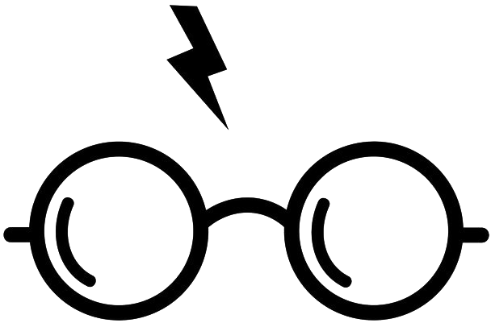

```{r pressure, echo=FALSE, out.width = '50%'}

```


```{r setup, include=FALSE}
knitr::write_bib("knitr", "cite.bib")
knitr::opts_chunk$set(echo = TRUE)
knitr::opts_chunk$set(
  echo = TRUE,
	message = FALSE,
	warning = FALSE
)
knitr::opts_chunk$set(echo = TRUE)
knitr::opts_chunk$set(
  echo = TRUE,
	message = FALSE,
	warning = FALSE
)
options(knitr.duplicate.label = "allow")
knitr::opts_chunk$set(echo = TRUE)
library(dplyr)
library(wordcloud)
library(devtools)
library(tidyverse)      
library(stringr)        
library(tidytext)
library(dplyr)
library(reshape2)
library(igraph)
library(ggraph)
if (packageVersion("devtools") < 1.6) {
  install.packages("devtools")
}

library(harrypotter)

titles <- c("Philosopher's Stone", "Chamber of Secrets", "Prisoner of Azkaban",
            "Goblet of Fire", "Order of the Phoenix", "Half-Blood Prince",
            "Deathly Hallows")
books <- list(philosophers_stone, chamber_of_secrets, prisoner_of_azkaban,
              goblet_of_fire, order_of_the_phoenix, half_blood_prince,
              deathly_hallows)
##Each book is an array in which each value in the array is a chapter 
series <- tibble()
for(i in seq_along(titles)) {
  
  temp <- tibble(chapter = seq_along(books[[i]]),
                  text = books[[i]]) %>%
    unnest_tokens(word, text) %>%
    ##Here we tokenize each chapter into words
    mutate(book = titles[i]) %>%
    select(book, everything())
  
  series <- rbind(series, temp)
}
# set factor to keep books in order of publication
series$book <- factor(series$book, levels = rev(titles))
series
```

```{r generateBibliography, echo=FALSE, eval=TRUE, message=FALSE, warning=FALSE}
require("knitcitations")
cleanbib()
options("citation_format" = "pandoc")
read.bibtex(file = "bibliography.bib")
```

## Introduction

Harry Potter book series is a legendary story that gained the readers’ love throughout the world and created such an influential brand that made its creator the second highest-paid author in the world [@cuccinello_2019]. Many children, including the author, grew up on the Harry Potter books. However, it might be quite simplistic to assert that Harry Potter is a series only for children. The book can be called an “all ages series” thanks to its composition that develops with each book. "So many Harry Potter fans now in their 20s and 30s have such a great attachment to it because every year when they were younger another book would come out", says Dr Smith [@buzacott-speer_2017], adding that, "in every book [the characters] become a bit more mature, the problems become a bit more complicated" []. The author also believes that with the characters getting mature, the world of the Harry Potter universe is also changing: the books become darker and more serious. The aim of this research is to analyze Harry Potter series with Rstudio and reveal how the magic universe alters throughout the years. The first part of the research will be more concentrated on the comparative sentiment analysis of the series while the second part will focus more on the details in the plot. The author’s initial assumption is that there might be discovered a gradual change in Harry Potter series throughout the books as well as in the characters’ behavior as well. 

## Methodology 

In order to analyze the series, the tidy approach in text mining is used because it allows the author to format the text with the unnest_tokens() function. Separating the text into individual words can be useful in summarizing and visualizing information. As it has already been noted, in the first part of the study, sentiment analysis on a tidy text dataset will be performed by grouping the series by books and comparing their sentiment lexicons respectively. The second part will be more concentrated on the frequency of the particular words in the books with the aim to prove the results of the sentiment analysis on the concrete examples. In addition, the general plot analysis will be conducted to analyze how the general plot alters with each book. All the analysis is run by RStudio on the basis of harrypotter library. 

```{r series}
summary(series)
```


## Sentiment analysis

The author believes that with each new Harry Potter series, the books are containing more and more negative sentiments progressively. To reveal whether it can be proved by the vocabulary of the books, sentiment analysis function is used. In fact, sentiment analysis is an approach to assessing the emotional coloring of the linguistic texts based on tonality dictionaries. For this research "bing" lexicon is used because all the words here are assigned for positive/negative sentiment. The diagram below illustrates how the amount of negative sentiment changers with each book. As it can be revealed from the graph, the amount of negative sentiment increases progressively from less than 500 in the first book to more than 2000 in the last one. There's a vivid progression except for "Half blood prince" that possesses less negative connotations. This might be explained by the fact that the plot of the book is mostly concentrated on Dumbledore’s memories of younger Voldemort rather than on the battle with him.  


```{r, echo=FALSE}
library(tidyr) 
hp_sentiment <- series %>% 
group_by(book) %>% 
inner_join(get_sentiments("bing")) %>% 
count(book, index = chapter %/% 80, sentiment) %>% pivot_wider(names_from = sentiment, values_from = n, values_fill = 0) %>% 
mutate(sentiment = positive - negative)

library(ggplot2) 
ggplot(hp_sentiment, aes(index, sentiment, fill = book)) + geom_col(show.legend = FALSE) + 
facet_wrap(~book, ncol = 4, scales = "free_x")

```

While there are many dark moments in the book, it is still a children story. The graph below shows that positive sentiment still prevails in every book (in red color).

```{r, echo=FALSE}
series %>%
group_by(book) %>%
inner_join(get_sentiments("bing")) %>%
count(book, word, sentiment) %>%
ggplot(aes(n, book, fill = sentiment)) +
geom_col(show.legend = FALSE)
```

Another question that comes to mind is what are the most common negative sentiment words in the books.The graphs below reveal that the most frequent negative word appears to be "dark" that is obviously connected with the main negative character Voldemort (also known as Dark Lord). Moreover, although being a book for children, "death" takes the second place. However, real deaths in the book are not that common at the beginning of the story with the first murder of a positive character only in the forth book "Goblet of Fire" disposed of by Peter Pettigrew. These results indicate that it might be useful to analyze how the words mostly connected with negative sentiments change with each book. 


```{r, echo=FALSE}

bing_word_counts <- series %>% 
inner_join(get_sentiments("bing")) %>% 
count(word, sentiment, sort = TRUE) %>% 
ungroup() 

bing_word_counts %>% 
group_by(sentiment) %>% 
slice_max(n, n = 10) %>% 
ungroup() %>% 
mutate(word = reorder(word, n)) %>% 
ggplot(aes(n, word, fill = sentiment)) + 
geom_col(show.legend = FALSE) + 
facet_wrap(~sentiment, scales = "free_y") + 
labs(x = "Contribution to sentiment", y = NULL)

```


## Word frequency analysis
When analyzed the table indicating the most common negative words, it's apparent that some of them are associated with death and Dark Lord. In this part of the research the author would like to analyze how attitude to Voldemort and death is changed throughout the books. 

Deaths are mounting up book by book, with each one being more traumatic and terrifying than the last. The graph below illustrates how the frequency of the word “death” is altering with each book. The concept of death plays a key role in Harry Potter book series. The author would like to compare the attitude to life and death of the main positive character - Harry Potter - and negative one - Voldemort. Voldemort tried to conquer death by coming into conflict with nature. As a result, he suffered from his own selfish catch-up game. At the same time, Harry Potter was not afraid of death:  as Dumbledore admitted: “For a highly organized mind, death is another adventure”. Rowling contrasts the feelings of the protagonist (love and will to live) and the Dark Lord (dependence and fear of death), eventually, Harry, unafraid of death, survives, while Voldemort, foolishly trying to hide from her, falls into her trap. It is apparent that with each book, as the characters and readers mature, Rowling delves into the topic of death and the attitude towards it.

```{r, echo=FALSE}

death <- series %>%
group_by(book) %>%
count(word) %>%
filter(word == "death") 

death %>%
ggplot(aes(x = book, y = n)) +
geom_col(color = 'black', fill = 'darkcyan') +
coord_flip()

```


Fears have a special place and meaning in the Harry Potter books: Rowling wants to convey to the reader an unambiguous philosophy of fears and their overcoming. Although Voldemort is becoming more and more powerful and deaths are becoming more and more common, it is apparent that with each book the characters are gradually getting reg rid of the fear behind him. In the first book, Albus Dumbledore told Harry: “Call him Voldemort, Harry. Always use the proper name for things. Fear of a name increases fear of the thing itself” [@rowling_2014]. Although Harry has always been calling Voldemort by name, the rest of the characters preferred a more secure You-Know-Who avoiding a taboo word. The graph below reveals that this changes with each book. Being used less that 50 tomes in the first book, the number increases significantly to more than 300 in the last one.

```{r, echo=FALSE}
voldemort <- series %>%
group_by(book) %>%
count(word) %>%
filter(word == "voldemort") 

voldemort %>%
ggplot(aes(x = book, y = n)) +
   geom_col(color = 'black', fill = 'cadetblue3') +
coord_flip()

```
The forth book "Goblet of Fire" is often considered to be a breaking point in Harry Potter series. In her study, Julia Eccleshare admits that Rowling highlights her new ambitions as a writer by moving away from the tight school-story framework to a representation more an adult hero [@eccleshare2002guide]. Harry, Ron and Hermione are now fourteen. On the one hand, Joanne Rowling shows them as quite moody teenagers with their obvious problems about possible girlfriends/boyfriends. The Triwizard Tournament (the competition of wizzard where Harry accidentally participates) not only introduces new parts of the magical world but also opens up new possibilities of danger for Harry. In this parts, readers as well as main characters learn about unforgivable curses: Avada Kedavra - to kill one, Crucio - for tortures, Imperio - to obey the will. As displayed on the graph below, the usage of such curses is on its peak in the forth part. It seems that in this very part  the heroes are in real danger: there are deaths eaters, Voldemort in a new guise and the first death. The heroes were growing up and Rowling needed to make some changes to substantiate the growing up keep the attention of her core readership at the same time. 

```{r, echo=FALSE}
curses <- series %>%
group_by(book) %>%
count(word) %>%
filter(word == "avada" | word == "crucio" | word == "cruciatus") 


curses_viz <- curses %>%
group_by(book) %>%
  summarize(n) 

curses_viz  %>%
ggplot(aes(x = book, y = n)) +
   geom_col(color = 'black', fill = 'cadetblue3')

```


## General plot analysis
The author believes that with each new book, J.K. Rowling introduces new characters that symbolize new themes and affect not only Harry's life in different ways, but also the development of the plot. In order to analyze it, the tf-idf approach is used to define how important a word is to a collection of texts. Tf-idf approach decreases the weight of commonly used words and increases the weight for words that are not used very much in a collection of documents.The author decided to use this method to highlight the most peculiar topic of each Harry Potter series. As it can be seen from the graphs, proper nouns are in fact most important in each book. Every year at Hogwarts, there was a change in Defense Against the Dark Arts teacher: Quirrell - Lockhart - Lupin - Mad-Eye Moody - Umbridge. In the last two books, Professor Snape takes this position (however, this is not a new character, so his name is not on the tf-idf list). Due to Voldemort's curse, none of the Defense Against the Dark Arts professors can hold out for more than a year. Like all books, the approach of the teachers changed every year and taught something not only to the heroes, but also to the readers themselves. Quirrell's duplicity, Lockhart's narcissism, Lupine's decency and honesty, Moody's fearsome approach and Umbridge's theoretical focus seem specialties designed to resonate with readers.

```{r, echo=FALSE}

hp_tf_idf <- series %>%
    count(book, word, sort = TRUE) %>%
    bind_tf_idf(word, book, n) %>%
    arrange(-tf_idf) %>%
    group_by(book) %>%
    top_n(7) %>%
    ungroup

hp_tf_idf %>%
    mutate(word = reorder_within(word, tf_idf, book)) %>%
    ggplot(aes(word, tf_idf, fill = book)) +
    geom_col(alpha = 0.8, show.legend = FALSE) +
    facet_wrap(~ book, scales = "free", ncol = 3) +
    scale_x_reordered() +
    coord_flip() +
    theme(strip.text=element_text(size=11)) +
    labs(x = NULL, y = "tf-idf",
         title = "Highest tf-idf words in Harry Potter series",
         subtitle = "Individual stories focus on different characters and narrative elements")

```


## Conclusion

To conclude, although there's still clear field for further research, the study proves the initial assumption that Harry Potter book series is developing with each released book. Joanne Rowling adds new themes and develops the characters as they are getting older. With each book, Joanne Rowling introduces new characters, while simultaneously developing a plot tied to key characters. This creates the impression of a voluminous magical world that seems to really exist next to ours. This might be one of the reasons for such a success of Harry Potter brand. Although remaining a book for children with its apparent predictability, a well-defined sense of right and wrong, the story has developed dramatically from the first book to the last to keep the readers attentive and interested till the very end. The Harry Potter series is a story of growing up, becoming a personality, a story that turns a children fairy tale into a novel.

Brown, Stephen. Wizard!: Harry Potter’s Brand Magic (Great Brand Stories Series). Cyan Communications, 2005.
Heilman, Elizabeth. Critical Perspectives on Harry Potter. Abingdon, United Kingdom, Taylor & Francis, 2008.
library(harrypotter)

## References


